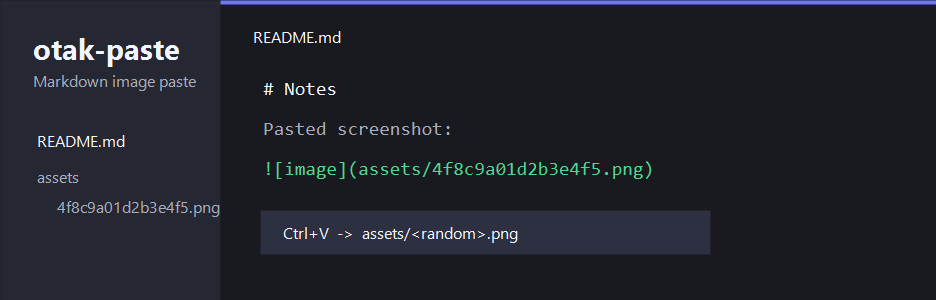

<p align="center">
  <h1 align="center">otak-paste</h1>
  <p align="center">Paste Markdown images into a local assets folder with random PNG file names.</p>
</p>

---

Paste an image into a saved Markdown file. otak-paste writes the image next to the Markdown file under `assets/` and inserts the Markdown image link for you.



## Quick Start

1. Install from the [VS Code Marketplace](https://marketplace.visualstudio.com/items?itemName=odangoo.otak-paste).
2. Open a saved Markdown file.
3. Copy a PNG image or take a screenshot.
4. Paste with `Ctrl+V` / `Cmd+V`.

otak-paste creates `assets/<random>.png` beside the Markdown file and inserts:

```markdown

```

The `image` alt text is selected after paste so you can replace it immediately.

## Features

- **Markdown paste flow** — Works from the normal editor paste action.
- **Local assets folder** — Saves images under `assets/` beside the current Markdown file.
- **Random PNG names** — Uses 16 hex characters, for example `assets/4f8c9a01d2b3e4f5.png`.
- **Editable alt text** — Inserts a snippet so the alt text can be edited right away.
- **Quiet success path** — No success notification is shown when paste succeeds.
- **Localized UI** — UI messages follow your VS Code display language.

UI language supports English, Japanese, Chinese (Simplified), Chinese (Traditional, Taiwan), Korean, Vietnamese, Spanish, Portuguese (Brazil), French, German, Hindi, Indonesian, Italian, Russian, Arabic, and Turkish.

## How It Works

When a PNG image is available on the clipboard and the active editor is a saved Markdown file, otak-paste:

1. Resolves the Markdown file directory.
2. Creates an `assets/` folder if needed.
3. Generates a random 16-character hex file name.
4. Saves the pasted PNG image into `assets/`.
5. Inserts a Markdown image link at the paste location.

Only local `file:` Markdown documents are supported in v1. Untitled documents, virtual documents, remote-only documents, non-PNG clipboard data, and copied image files are left to VS Code's default paste behavior.

## Requirements

- VS Code 1.125.0 or higher
- A saved local Markdown file
- PNG image data on the clipboard

## Installation

Install from the [VS Code Marketplace](https://marketplace.visualstudio.com/items?itemName=odangoo.otak-paste).

For local development, build and install the VSIX:

```bash
npm install
npm run package
code --install-extension otak-paste-0.1.0.vsix
```

Reload VS Code after installation if the Markdown editor was already open.

## Security & Privacy

### Local File Writes

- Creates an `assets/` folder beside the current Markdown file.
- Writes pasted PNG image data to a random `.png` file in that folder.
- Does not upload images or send clipboard data over the network.

### Workspace Settings

- Does not change VS Code settings automatically.
- Does not require an account, API key, or external service.

## Troubleshooting

- **Nothing happens when pasting**: Make sure the Markdown file has been saved and the clipboard contains PNG image data.
- **VS Code's built-in Markdown paste wins**: In that workspace, set `"markdown.editor.filePaste.enabled": "never"` and try again. otak-paste does not change this setting for you.
- **Image is saved in an unexpected place**: The `assets/` folder is created beside the active Markdown file, not at the workspace root.
- **JPEG/GIF/WebP is not handled**: v1 only handles clipboard PNG data.

## Related Extensions

- **[otak-proxy](https://marketplace.visualstudio.com/items?itemName=odangoo.otak-proxy)** — Proxy settings for VS Code, Git, npm, and integrated terminals.
- **[otak-monitor](https://marketplace.visualstudio.com/items?itemName=odangoo.otak-monitor)** — Real-time system monitoring in VS Code.
- **[otak-committer](https://marketplace.visualstudio.com/items?itemName=odangoo.otak-committer)** — AI-assisted commit messages, pull requests, and issues.
- **[otak-restart](https://marketplace.visualstudio.com/items?itemName=odangoo.otak-restart)** — Quick reload shortcuts.
- **[otak-clock](https://marketplace.visualstudio.com/items?itemName=odangoo.otak-clock)** — Dual time zone clock for VS Code.

## License

MIT License. See the [LICENSE](LICENSE) file for details.

## Links

- **[VS Code Marketplace](https://marketplace.visualstudio.com/items?itemName=odangoo.otak-paste)**
- **[GitHub](https://github.com/tsuyoshi-otake/otak-paste)**
- **[Issues](https://github.com/tsuyoshi-otake/otak-paste/issues)**
